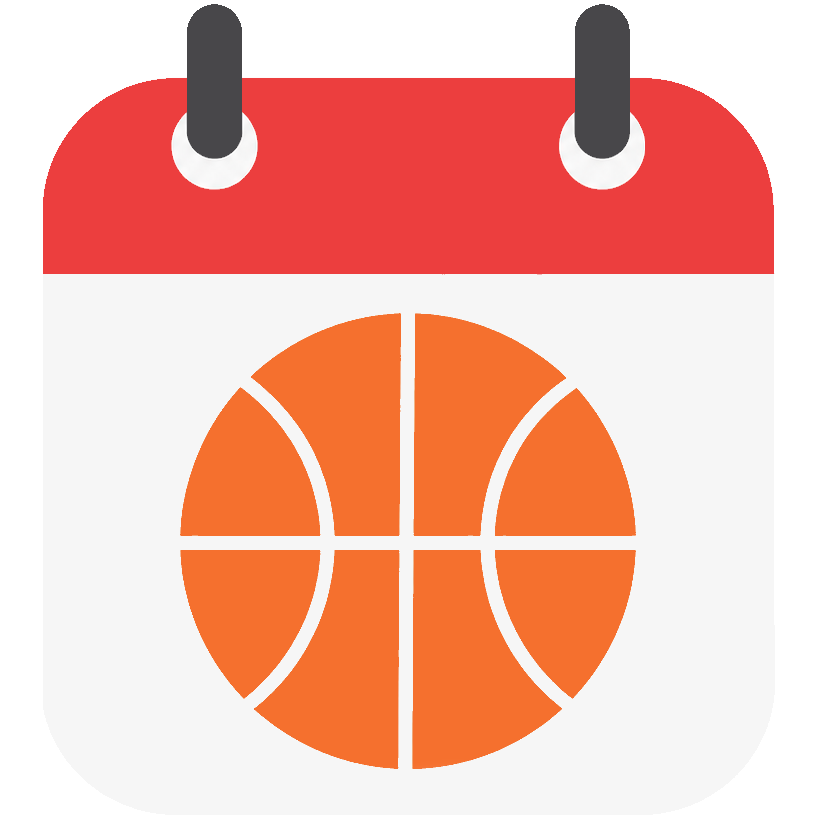
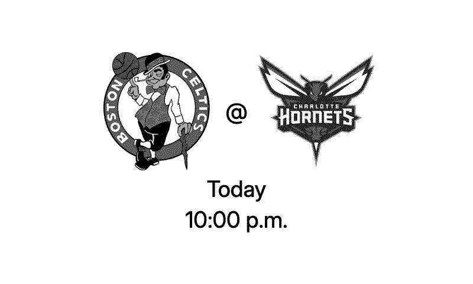

# Next Game



A [TRMNL](https://usetrmnl.com) plugin that shows your favorite team's next scheduled game. Pick a team, pick a filter (any / home / away), and your TRMNL displays the matchup, date, time, and venue — refreshed every 15 minutes.



## Features

- **Many sports, many countries** — every major North American team-sport league, top-flight European soccer, AFL, NRL, IPL, and Big Bash. See the [full list](#supported-leagues) below.
- **Home/away filtering** — show only home games, only away games, or any next game.
- **Local time** — game times render in the timezone configured on your TRMNL device.
- **Multiple layouts** — full-screen, half-horizontal, half-vertical, and quadrant variants are all included.
- **E-ink-aware logos** — team badges that would otherwise render invisible on the device's white background (e.g. Trail Blazers' white-on-transparent shield) are auto-detected and inverted so they show up.

## Setup

1. Install **Next Game** from the TRMNL plugin marketplace.
2. In the plugin settings, type your team's **city name** or full team-name prefix in the **Team** field — for example, `Chicago` or `Golden State` — then select your team from the dropdown.
3. Choose a **Game Filter**: any next game, next home game, or next away game.

> **Search tip:** TheSportsDB matches on city or team name prefix, not nicknames. Search for `Chicago` (not `Bulls`) or `Golden State` (not `Warriors`).

## Supported leagues

**North America**

| League                              | Sport               |
| ----------------------------------- | ------------------- |
| NHL                                 | Hockey              |
| NBA                                 | Basketball          |
| MLB                                 | Baseball            |
| NFL                                 | American football   |
| MLS                                 | Soccer              |
| WNBA                                | Basketball          |
| NWSL                                | Soccer              |
| NCAA Division I Men's Basketball    | Basketball          |
| NCAA Division I Women's Basketball  | Basketball          |
| NCAA Division I Football            | American football   |
| CFL                                 | Canadian football   |

**Europe (soccer)**

| League                | Country  |
| --------------------- | -------- |
| Premier League        | England  |
| La Liga               | Spain    |
| Bundesliga            | Germany  |
| Serie A               | Italy    |
| Ligue 1               | France   |

**Australia**

| League | Sport                    |
| ------ | ------------------------ |
| AFL    | Australian rules football |
| NRL    | Rugby league              |

**Cricket**

| League                             | Country        |
| ---------------------------------- | -------------- |
| Indian Premier League (IPL)        | India          |
| Big Bash League (BBL)              | Australia      |

If your league isn't here, please [open an issue](https://github.com/CarterPape/trmnl-sports/issues) — adding leagues is usually a small change as long as TheSportsDB covers them.

## How it works

The plugin polls a small [Cloudflare Worker](cloudflare-worker/index.js) at `trmnl-sports.carter-pape.workers.dev`, which in turn calls [TheSportsDB v2 API](https://www.thesportsdb.com). The Worker:

- Filters team-search results to the supported leagues (so you don't pick a team this plugin can't actually display).
- Computes the current season string per league (split-year leagues like the NHL vs. single-year leagues like MLB are handled differently).
- Caches both team-search and next-game responses to keep TheSportsDB load (and your TRMNL polling) light.
- Pre-computes a per-badge "needs inversion" flag by sampling each team logo's pixel luminance, so the templates can render white-on-transparent badges visibly.

If you'd rather host the Worker yourself — for instance, to use your own TheSportsDB API key — see [Self-hosting](#self-hosting) below.

## Self-hosting

You can run your own copy of the Worker if you want full control over the backend.

### Requirements

- A [Cloudflare](https://dash.cloudflare.com) account (Workers free tier is sufficient).
- A [TheSportsDB](https://www.thesportsdb.com) API key. **The v2 API is Patreon-tier only**, so you'll need to support TheSportsDB to obtain a key.
- [Wrangler](https://developers.cloudflare.com/workers/wrangler/) installed: `npm install -g wrangler`

### Deploy

```bash
git clone https://github.com/CarterPape/trmnl-sports.git
cd trmnl-sports/cloudflare-worker
npm install
wrangler login
wrangler secret put SPORTSDB_API_KEY      # paste your key when prompted
npx wrangler deploy
```

After deploy, update `polling_url` and the `endpoint:` field in `src/settings.yml` to point to *your* Worker URL, then `trmnlp push` your fork.

### Local preview

The repo is `trmnlp`-compatible. See the [parent repo's README](../) for the local-preview prerequisites (Ruby 3.4.9 via rbenv, Firefox + geckodriver, ImageMagick). Then create a `.trmnlp.yml` (gitignored) with a real team ID:

```yaml
custom_fields:
  team_id: "TEAM_ID|LEAGUE_ID"   # find via: curl "https://trmnl-sports.carter-pape.workers.dev/teams?q=Chicago"
  game_type: "any"               # any | home | away
```

…then run `trmnlp serve` from the project root.

## Known limitations

- Only the leagues listed above are searchable. Tennis, F1, and tournament-only competitions (e.g. World Cup, UEFA Champions League as a standalone selection) aren't supported.
- The plugin shows one upcoming game at a time — not a full schedule.
- Game times come from TheSportsDB; a small fraction of events arrive without a precise time, in which case only the date is shown.
- After a game finishes, it stays on screen for up to four hours before the plugin advances to the next game (TheSportsDB occasionally lags on marking events complete).

## Issues and contributions

Bug reports and feature requests are welcome at <https://github.com/CarterPape/trmnl-sports/issues>.

## License

Copyright © 2026 Carter Pape.

Released under the [GNU General Public License v3.0 or later](LICENSE). The Cloudflare Worker source, Liquid templates, and assets in this repository are all GPL-licensed; if you fork or self-host, your modifications must be released under the same terms.

Sports data is provided by [TheSportsDB](https://www.thesportsdb.com), which has its own terms of use.
